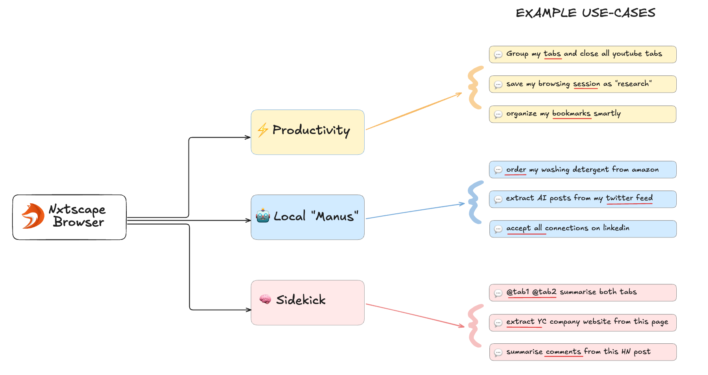

# Nxtscape
### The Open-source Agentic Browser

Nxtscape ("next-scape") is an open-source agentic browser - your privacy-first alternative to closed-source browsers like Arc, Dia, and Perplexity Comet. Built on Chromium, Nxtscape lets you run Manus-like agents locally and boost your productivity with an AI sidekick.

  

## What is Nxtscape?

Looks like Chrome, but with AI superpowers.

 

## Why We're Building This

For the first time since Netscape in 1994, it feels like we can reimagine browsers from scratch. We saw how Cursor gave developers a 10x productivity boost, yet browsers feel stuck in the past.

Think about it: you probably have 70+ tabs open right now. You're constantly fighting your browser instead of it helping you. Simple tasks like "order Tide Pods from my Amazon order history" should just work with AI agents. Form-filling is still a huge pain. 

We believe AI agents should automate your work locally and securely, not send your data to some search or ad company.

## Quick Start

1. [Download Nxtscape for macOS](https://bit.ly/4k0gjsD)
2. Install and launch
3. Import data from Google Chrome - extensions, history, bookmarks, etc. (optional)
4. Start using AI features with your own API keys or local models

 

## Features

- Works with all your Chrome extensions  
- AI agents run locally on your browser, not in the cloud
- Privacy first: bring your own keys or use local models with Ollama
- 100% open source 
- Coming soon: MCP store for one-click agent installs
- Coming soon: AI-powered ad blocker

 

## See It In Action

### AI Agents ([video](https://storage.googleapis.com/felafax-public/nxtscape/nxtscape-agent.mp4))

### Local AI Chat ([video](https://storage.googleapis.com/felafax-public/nxtscape/nxtscape-chat.mp4))

### Productivity Tools ([video](https://storage.googleapis.com/felafax-public/nxtscape/nxtscape-productivity.mp4))

 

## Get Involved

We'd love to hear what problems you'd like to see solved! Share your ideas through our [anonymous form](https://dub.sh/nxtscape-feature-request).

- Join our [Discord](https://discord.gg/YKwjt5vuKr)
- Follow us on [Twitter/X](https://twitter.com/nxtscape)
- Check our [Roadmap](https://nxtscape.feedbear.com/roadmap)

 

## What Makes Nxtscape Different?

We know there are other browsers. Here's why Nxtscape stands out:

### Nxtscape vs Chrome
While we're grateful for Google open-sourcing Chromium, the Chrome browser hasn't evolved much over the last 10 years and it lacks meaningful AI features (agentic automation, MCP support, etc). 

### Nxtscape vs Brave
We love what Brave started, but they've spread themselves too thin with crypto, search, VPNs, and other projects. Nxtscape is laser-focused on building the best AI-powered, productivity-focused, private browser. We want to bring you latest AI features sooner, like agentic automation and integrating MCP!

### Nxtscape vs Arc/Dia
Many loved Arc, but it was closed source. When the company abandoned it, users were left behind. That will never happen with Nxtscape. We are 100% open source. If you don't like the direction we're going, you or the community can fork the code and build your own version. Power to the people!

### Nxtscape vs Perplexity Comet
Perplexity is a search company. Your browser history will likely be used for ad targeting eventually. We are NOT a search company. If you're switching from Chrome, choose a truly privacy-first browser instead of another data collector. Choose Nxtscape.

 

## Acknowledgments

Inspired by [browser-use](https://github.com/browser-use/browser-use), [Nanobrowser](https://github.com/nanobrowser/nanobrowser), [Stagehand](https://github.com/browserbase/stagehand), and built on [Chromium](https://github.com/chromium/chromium).

 

## License
Nxtscape is licensed under AGPL-3.0 license. See the `LICENSE` file for details.
